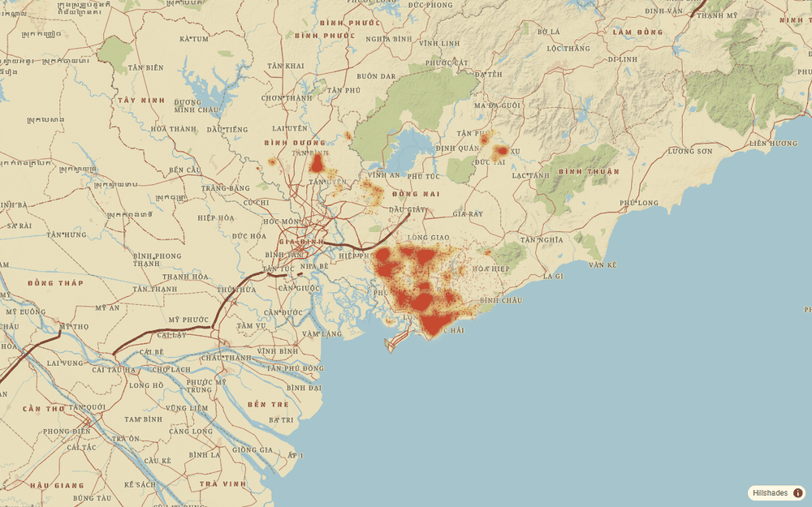
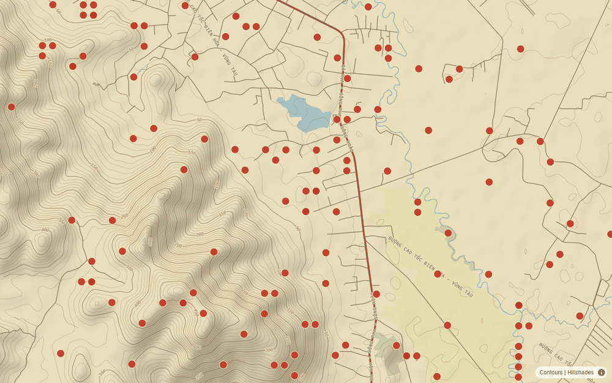

# Vintage basemap style

A TileServer GL style package for the Battle Map: a 1960s military topographic sheet. It is built from the `ww2` base
package (OpenMapTiles layers, same filters and structure) and re-skinned, with contours, hillshade and land-cover tints
added from the tile server's other tilesets. The contact heatmap and markers draw over it in the site's khaki to red
ramp, so the base is deliberately quiet: pale paper, muted greens and blues, and roads in browns and brick red rather
than the bright red of the contacts.

| Overview (z8) | Nui Dat (z14) |
|---|---|
|  |  |

Base-map-only previews are in `preview/` (`overview-z8`, `saigon-z10`, `nui-dat-z11`, `vung-tau-z12`, `nui-dat-z14`).

## Import into TileServer GL

1. Copy this folder to the tile server's styles directory as `vintage/`, so `vintage/style-local.json` and the four
   `vintage/sprite*` files sit together.
2. Add the style to `config.json` (see `tileserver-config.snippet.json`):

   ```json
   "styles": {
     "vintage": { "style": "vintage/style-local.json" }
   }
   ```
3. Restart TileServer GL. The style is then served at `/styles/vintage/style.json`.

The style refers to things that must already exist on the server (the `terrain` style uses all of them):

| Needs | Used for |
|---|---|
| data id `v3` | OpenMapTiles vector tiles: land cover, water, roads, places |
| data id `hillshading` | the raster hillshade |
| data id `contours` | vector contour lines (`contour` layer, `height` and `nth_line`) |
| fonts `Noto Serif` (Regular, Bold, Italic), `IBM Plex Mono` (Regular, Bold, Italic), `Saira Stencil One Regular`, plus the `Noto Sans` faces already on the server | every label. Install from `../fonts` (see its README) |

`style-local.json` keeps the TileServer GL placeholders (`mbtiles://{v3}`, `{styleJsonFolder}/sprite`,
`{fontstack}/{range}.pbf`), exactly as the `ww2` package does.

## Point the app at it

The API serves the basemap list from configuration. Once the style is on the tile server, set the Vintage entry's
`style` to `https://<tile server>/styles/vintage/style.json`:

- local development: `server/src/Avw.Api/appsettings.Development.json`, `Map:Basemaps`
- clusters: `map.basemaps` in `deploy/helm/avw-api/values.yaml`

(Both now point at the imported `vintage` style, and it is the default basemap.)

## Palette

Paper, ink, brass and contact red come from the design tokens in `web/src/styles.scss`; the rest are period map colours.

| Element | Colour |
|---|---|
| Paper (background) / label halo | `#e9dfbc` / `#f1e9cc` |
| Forest, scrub, grass, farmland, wetland, sand | `#bcc78d`, `#cfd3a0`, `#dadeae`, `#e5dfae`, `#c3d4b3`, `#ecdcab` |
| Built-up area / buildings | `#d9c49b` / `#c8b285` |
| Water / waterway / water names | `#a6c4cc` / `#88aab6` / `#3c6577` |
| Contours / index contours | `#a7794a` / `#875c33` |
| Trunk and primary roads, casing | `#a9503b`, `#5e3122` |
| Secondary roads, casing | `#cf9a55`, `#735535` |
| Minor roads and tracks | `#7d6a4f` |
| Railways | `#4a4136`, with paper-coloured ticks |
| Boundaries: country / province | `#8a4a3a` / `#8a5a3c` |
| Text | ink `#2b261b`, soft ink `#4d4230` |

## What differs from `ww2`

- Light paper theme instead of a dark one; sprites are unchanged (the small dark dot marks towns, which suits paper).
- Added: land cover (wood, grass, farmland, wetland, sand), hillshade, contours with elevation labels, and a road
  hierarchy by class (trunk/primary, secondary, everything else). Tertiary roads are drawn as minor roads, and
  low-zoom roads show only trunk and primary, so the overview is not a web of red lines.
- Type: Noto Serif for names (bold capitals for cities, regular capitals for towns and villages, italics for districts
  and water), IBM Plex Mono for road names and contour heights (a typewriter feel), and Saira Stencil One for provinces
  and countries. All are open-licence and cover every Vietnamese letter; see `../fonts/README.md`, which also explains
  why the site's own Courier Prime and Stardos Stencil could not be used on the map.

## Rebuilding

`build.py` generates `style-local.json` from the `ww2` package with the palette and fonts above, so a colour or font
change is a one-line edit:

```
python build.py <path to ww2/style-local.json> <output folder>
```

It writes `style-local.json` (the package file) and `style.json`, a copy with the placeholders resolved to
`https://tiles.hosting.gradata.com.au`, a sprite at `http://localhost:5190/sprite` and glyphs at
`http://localhost:5190/fonts/...`, for previewing in a browser (serve the output folder, with the glyph folders copied to
`fonts/` inside it, from any static server on port 5190 with CORS, and point a basemap entry at it).

## Checked

- Validates against the MapLibre style specification (`@maplibre/maplibre-gl-style-spec` 26.4.4) with no errors.
- Rendered with MapLibre GL JS 6.10.0 against the live tiles at zooms 8 to 14 with no console errors, with the contact
  layers on top.
